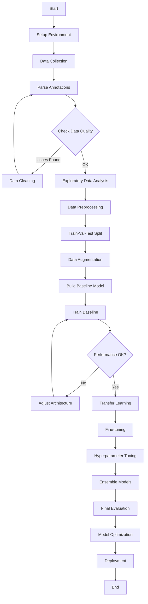

# RANCANGAN KERJA DETAIL
## KLASIFIKASI BAKTERI GRAM POSITIF DAN GRAM NEGATIF

---

## 📋 TABLE OF CONTENTS
1. [Workflow Lengkap](#workflow-lengkap)
2. [Setup Environment](#setup-environment)
3. [Data Preparation](#data-preparation)
4. [Model Development](#model-development)
5. [Training Strategy](#training-strategy)
6. [Evaluation Framework](#evaluation-framework)
7. [Deployment Plan](#deployment-plan)

---

## 1. WORKFLOW LENGKAP



---

## 2. SETUP ENVIRONMENT

### 2.1 Instalasi Dependencies

**File: `requirements.txt`**
```txt
# Deep Learning Framework
torch>=2.0.0
torchvision>=0.15.0
pytorch-lightning>=2.0.0

# Data Processing
numpy>=1.24.0
pandas>=2.0.0
opencv-python>=4.7.0
Pillow>=9.5.0
albumentations>=1.3.0
scikit-learn>=1.2.0
scipy>=1.10.0

# Visualization
matplotlib>=3.7.0
seaborn>=0.12.0
plotly>=5.14.0
tensorboard>=2.12.0

# JSON/Annotation
pycocotools>=2.0.6
labelme>=5.2.0

# Experiment Tracking
mlflow>=2.3.0
wandb>=0.15.0

# Hyperparameter Tuning
optuna>=3.1.0

# Web Framework
fastapi>=0.95.0
uvicorn>=0.22.0
streamlit>=1.22.0
python-multipart>=0.0.6

# Utilities
tqdm>=4.65.0
pyyaml>=6.0
python-dotenv>=1.0.0
loguru>=0.7.0

# Testing
pytest>=7.3.0
pytest-cov>=4.0.0

# Deployment
onnx>=1.14.0
onnxruntime>=1.15.0
docker>=6.1.0
```

### 2.2 Setup Script

**File: `setup.sh`**
```bash
#!/bin/bash

echo "🚀 Setting up Gram Bacteria Classification Project"

# Create virtual environment
python -m venv venv
source venv/bin/activate  # On Windows: venv\Scripts\activate

# Upgrade pip
pip install --upgrade pip

# Install dependencies
pip install -r requirements.txt

# Create directory structure
mkdir -p data/{raw,processed,annotations}
mkdir -p data/processed/{train,val,test}/{gram_positive,gram_negative}
mkdir -p notebooks
mkdir -p src/{data,models,training,evaluation,utils}
mkdir -p configs
mkdir -p experiments
mkdir -p models/checkpoints
mkdir -p app/templates
mkdir -p tests
mkdir -p logs

echo "✅ Setup complete!"
```

### 2.3 Configuration File

**File: `configs/config.yaml`**
```yaml
# Project Configuration
project:
  name: "gram-bacteria-classification"
  version: "1.0.0"
  seed: 42

# Paths
paths:
  dataset1: "data/raw/dataset 1"
  dataset2: "data/raw/dataset 2"
  processed: "data/processed"
  models: "models/checkpoints"
  logs: "logs"
  experiments: "experiments"

# Data
data:
  image_size: [640, 640]
  batch_size: 16
  num_workers: 4
  pin_memory: true
  
  # Split ratios
  train_ratio: 0.70
  val_ratio: 0.15
  test_ratio: 0.15
  
  # Augmentation
  augmentation:
    train:
      random_rotation: 30
      horizontal_flip: 0.5
      vertical_flip: 0.5
      brightness: 0.2
      contrast: 0.2
      saturation: 0.2
      hue: 0.1
      gaussian_blur: 0.3
      random_crop_scale: [0.8, 1.0]
    
    val_test:
      resize: [640, 640]
      normalize: true

# Model
model:
  architecture: "efficientnet_b0"  # resnet50, efficientnet_b0, vgg16, mobilenet_v2
  pretrained: true
  num_classes: 2
  dropout: 0.5
  
# Training
training:
  epochs: 100
  learning_rate: 0.0001
  optimizer: "adamw"
  weight_decay: 0.0001
  scheduler: "cosine"
  warmup_epochs: 5
  early_stopping_patience: 15
  gradient_clip: 1.0
  
  # Loss
  loss_function: "cross_entropy"  # cross_entropy, focal_loss
  label_smoothing: 0.1
  class_weights: null  # [1.0, 1.0] or "balanced"
  
  # Mixed Precision
  mixed_precision: true
  
# Evaluation
evaluation:
  metrics:
    - accuracy
    - precision
    - recall
    - f1_score
    - roc_auc
    - confusion_matrix
  
  save_predictions: true
  save_misclassified: true

# Logging
logging:
  use_tensorboard: true
  use_wandb: false
  wandb_project: "gram-classification"
  log_interval: 10
  save_checkpoint_interval: 5

# Hyperparameter Search
optuna:
  n_trials: 50
  study_name: "gram-classification-hpo"
  search_space:
    learning_rate: [1e-5, 1e-3]
    batch_size: [8, 16, 32]
    dropout: [0.3, 0.5, 0.7]
    weight_decay: [1e-5, 1e-3]
```

---

## 3. DATA PREPARATION

### 3.1 Parse Annotations

**File: `src/data/parse_annotations.py`**
```python
import json
import os
from pathlib import Path
from typing import Dict, List, Tuple
import pandas as pd
import numpy as np
from PIL import Image

class AnnotationParser:
    """Parse annotations from Dataset 1 (COCO) and Dataset 2 (LabelMe)"""
    
    def __init__(self, dataset1_path: str, dataset2_path: str):
        self.dataset1_path = Path(dataset1_path)
        self.dataset2_path = Path(dataset2_path)
        self.annotations = []
        
    def parse_dataset1_coco(self) -> List[Dict]:
        """Parse Dataset 1 with COCO format"""
        annotation_files = [
            'PBCs_microorgansim_annonation_annotator1.json',
            'PBCs_microorgansim_annonation_annotator2.json',
            'PBCs_microorgansim_annonation_DoubleCheck.json'
        ]
        
        # TODO: Implement COCO parsing
        # Need to determine how Gram +/- is labeled in this dataset
        pass
    
    def parse_dataset2_labelme(self) -> List[Dict]:
        """Parse Dataset 2 with LabelMe format"""
        json_dir = self.dataset2_path / '640DataSet' / 'json'
        image_dir = self.dataset2_path / '640DataSet' / 'images'
        
        annotations = []
        for json_file in json_dir.glob('*.json'):
            with open(json_file, 'r') as f:
                data = json.load(f)
            
            image_path = image_dir / data['imagePath']
            if not image_path.exists():
                continue
            
            # Extract labels (G+ or G-)
            for shape in data.get('shapes', []):
                label = shape['label']
                points = shape['points']
                
                annotations.append({
                    'image_path': str(image_path),
                    'image_name': data['imagePath'],
                    'label': label,  # 'G+' or 'G-'
                    'label_numeric': 0 if label == 'G+' else 1,
                    'polygon': points,
                    'image_width': data['imageWidth'],
                    'image_height': data['imageHeight']
                })
        
        return annotations
    
    def create_dataframe(self) -> pd.DataFrame:
        """Create pandas DataFrame from annotations"""
        # Parse both datasets
        dataset2_annotations = self.parse_dataset2_labelme()
        
        # TODO: Add dataset1 when parsing is implemented
        
        df = pd.DataFrame(dataset2_annotations)
        return df
    
    def save_to_csv(self, output_path: str):
        """Save annotations to CSV"""
        df = self.create_dataframe()
        df.to_csv(output_path, index=False)
        print(f"✅ Saved {len(df)} annotations to {output_path}")
        return df

# Usage
if __name__ == "__main__":
    parser = AnnotationParser(
        dataset1_path="data/raw/dataset 1",
        dataset2_path="data/raw/dataset 2"
    )
    df = parser.save_to_csv("data/annotations/all_annotations.csv")
    
    # Print statistics
    print("\n📊 Dataset Statistics:")
    print(df['label'].value_counts())
    print(f"\nTotal images: {df['image_name'].nunique()}")
```

### 3.2 Exploratory Data Analysis

**File: `notebooks/01_data_exploration.ipynb`**
```python
import pandas as pd
import matplotlib.pyplot as plt
import seaborn as sns
from PIL import Image
import numpy as np

# Load annotations
df = pd.read_csv("data/annotations/all_annotations.csv")

# 1. Class Distribution
plt.figure(figsize=(10, 6))
df['label'].value_counts().plot(kind='bar')
plt.title('Class Distribution: Gram+ vs Gram-')
plt.xlabel('Class')
plt.ylabel('Count')
plt.xticks(rotation=0)
plt.savefig('reports/class_distribution.png')
plt.show()

# 2. Image Size Distribution
print("Image sizes:")
print(df[['image_width', 'image_height']].describe())

# 3. Sample images
fig, axes = plt.subplots(2, 5, figsize=(15, 6))
for i, (idx, row) in enumerate(df.sample(10).iterrows()):
    if i < 10:
        img = Image.open(row['image_path'])
        ax = axes[i//5, i%5]
        ax.imshow(img)
        ax.set_title(f"Label: {row['label']}")
        ax.axis('off')
plt.tight_layout()
plt.savefig('reports/sample_images.png')
plt.show()

# 4. Check for duplicates
print(f"\nDuplicate images: {df['image_name'].duplicated().sum()}")

# 5. Class imbalance ratio
gram_pos = (df['label'] == 'G+').sum()
gram_neg = (df['label'] == 'G-').sum()
print(f"\nClass Imbalance Ratio: {max(gram_pos, gram_neg) / min(gram_pos, gram_neg):.2f}")
```

### 3.3 Data Preprocessing

**File: `src/data/preprocessing.py`**
```python
import cv2
import numpy as np
from PIL import Image
import torch
from torchvision import transforms

class GramDataPreprocessor:
    """Preprocessing pipeline for Gram bacteria images"""
    
    def __init__(self, image_size=(640, 640), normalize=True):
        self.image_size = image_size
        self.normalize = normalize
        
        # ImageNet statistics (for transfer learning)
        self.mean = [0.485, 0.456, 0.406]
        self.std = [0.229, 0.224, 0.225]
    
    def load_image(self, image_path: str) -> np.ndarray:
        """Load image from path"""
        img = cv2.imread(image_path)
        img = cv2.cvtColor(img, cv2.COLOR_BGR2RGB)
        return img
    
    def resize(self, image: np.ndarray) -> np.ndarray:
        """Resize image to target size"""
        return cv2.resize(image, self.image_size, interpolation=cv2.INTER_AREA)
    
    def normalize_image(self, image: np.ndarray) -> np.ndarray:
        """Normalize image to [0, 1] and standardize"""
        image = image.astype(np.float32) / 255.0
        if self.normalize:
            image = (image - self.mean) / self.std
        return image
    
    def crop_region(self, image: np.ndarray, polygon: list) -> np.ndarray:
        """Crop bacterial region from polygon"""
        # Convert polygon to bounding box
        points = np.array(polygon, dtype=np.int32)
        x, y, w, h = cv2.boundingRect(points)
        
        # Add padding
        padding = 20
        x = max(0, x - padding)
        y = max(0, y - padding)
        w = min(image.shape[1] - x, w + 2*padding)
        h = min(image.shape[0] - y, h + 2*padding)
        
        cropped = image[y:y+h, x:x+w]
        return cropped
    
    def preprocess(self, image_path: str, polygon: list = None) -> torch.Tensor:
        """Full preprocessing pipeline"""
        # Load image
        image = self.load_image(image_path)
        
        # Crop if polygon provided
        if polygon is not None:
            image = self.crop_region(image, polygon)
        
        # Resize
        image = self.resize(image)
        
        # Normalize
        image = self.normalize_image(image)
        
        # Convert to tensor [C, H, W]
        image = torch.from_numpy(image).permute(2, 0, 1).float()
        
        return image

# Usage
preprocessor = GramDataPreprocessor()
image_tensor = preprocessor.preprocess("path/to/image.jpg")
```

### 3.4 Train-Val-Test Split

**File: `src/data/split_dataset.py`**
```python
import pandas as pd
import shutil
from pathlib import Path
from sklearn.model_selection import train_test_split

def split_dataset(annotations_csv: str, 
                  output_dir: str,
                  train_ratio: float = 0.7,
                  val_ratio: float = 0.15,
                  test_ratio: float = 0.15,
                  random_state: int = 42):
    """Split dataset into train, validation, and test sets"""
    
    # Load annotations
    df = pd.read_csv(annotations_csv)
    
    # Get unique images (one image may have multiple annotations)
    unique_images = df.groupby('image_name').agg({
        'label': 'first',  # Take first label
        'image_path': 'first'
    }).reset_index()
    
    # First split: train + val vs test
    train_val, test = train_test_split(
        unique_images,
        test_size=test_ratio,
        stratify=unique_images['label'],
        random_state=random_state
    )
    
    # Second split: train vs val
    val_size = val_ratio / (train_ratio + val_ratio)
    train, val = train_test_split(
        train_val,
        test_size=val_size,
        stratify=train_val['label'],
        random_state=random_state
    )
    
    # Create directories
    output_path = Path(output_dir)
    for split in ['train', 'val', 'test']:
        for label in ['gram_positive', 'gram_negative']:
            (output_path / split / label).mkdir(parents=True, exist_ok=True)
    
    # Copy files
    def copy_images(df_split, split_name):
        for _, row in df_split.iterrows():
            src = row['image_path']
            label_dir = 'gram_positive' if row['label'] == 'G+' else 'gram_negative'
            dst = output_path / split_name / label_dir / row['image_name']
            
            shutil.copy2(src, dst)
    
    print("📁 Copying files...")
    copy_images(train, 'train')
    copy_images(val, 'val')
    copy_images(test, 'test')
    
    # Save split info
    train.to_csv(output_path / 'train.csv', index=False)
    val.to_csv(output_path / 'val.csv', index=False)
    test.to_csv(output_path / 'test.csv', index=False)
    
    # Print statistics
    print("\n✅ Dataset split complete!")
    print(f"Train: {len(train)} images")
    print(f"  - Gram+: {(train['label'] == 'G+').sum()}")
    print(f"  - Gram-: {(train['label'] == 'G-').sum()}")
    print(f"Val: {len(val)} images")
    print(f"  - Gram+: {(val['label'] == 'G+').sum()}")
    print(f"  - Gram-: {(val['label'] == 'G-').sum()}")
    print(f"Test: {len(test)} images")
    print(f"  - Gram+: {(test['label'] == 'G+').sum()}")
    print(f"  - Gram-: {(test['label'] == 'G-').sum()}")

# Usage
if __name__ == "__main__":
    split_dataset(
        annotations_csv="data/annotations/all_annotations.csv",
        output_dir="data/processed"
    )
```

---

## 4. MODEL DEVELOPMENT

### 4.1 Custom Dataset Class

**File: `src/data/dataset.py`**
```python
import torch
from torch.utils.data import Dataset
from PIL import Image
import albumentations as A
from albumentations.pytorch import ToTensorV2

class GramBacteriaDataset(Dataset):
    """PyTorch Dataset for Gram bacteria classification"""
    
    def __init__(self, image_paths, labels, transform=None):
        self.image_paths = image_paths
        self.labels = labels
        self.transform = transform
    
    def __len__(self):
        return len(self.image_paths)
    
    def __getitem__(self, idx):
        # Load image
        image = Image.open(self.image_paths[idx]).convert('RGB')
        image = np.array(image)
        
        # Apply transformations
        if self.transform:
            augmented = self.transform(image=image)
            image = augmented['image']
        
        label = torch.tensor(self.labels[idx], dtype=torch.long)
        
        return image, label

# Training augmentation
train_transform = A.Compose([
    A.Resize(640, 640),
    A.HorizontalFlip(p=0.5),
    A.VerticalFlip(p=0.5),
    A.Rotate(limit=30, p=0.5),
    A.ColorJitter(brightness=0.2, contrast=0.2, saturation=0.2, hue=0.1, p=0.5),
    A.GaussianBlur(blur_limit=(3, 7), p=0.3),
    A.Normalize(mean=[0.485, 0.456, 0.406], std=[0.229, 0.224, 0.225]),
    ToTensorV2()
])

# Validation/Test augmentation
val_transform = A.Compose([
    A.Resize(640, 640),
    A.Normalize(mean=[0.485, 0.456, 0.406], std=[0.229, 0.224, 0.225]),
    ToTensorV2()
])
```

### 4.2 Model Architecture - ResNet

**File: `src/models/resnet.py`**
```python
import torch
import torch.nn as nn
import torchvision.models as models

class GramResNet(nn.Module):
    """ResNet for Gram bacteria classification"""
    
    def __init__(self, model_name='resnet50', num_classes=2, pretrained=True, dropout=0.5):
        super(GramResNet, self).__init__()
        
        # Load pretrained ResNet
        if model_name == 'resnet50':
            self.backbone = models.resnet50(pretrained=pretrained)
        elif model_name == 'resnet101':
            self.backbone = models.resnet101(pretrained=pretrained)
        else:
            raise ValueError(f"Unknown model: {model_name}")
        
        # Get number of features from last layer
        num_features = self.backbone.fc.in_features
        
        # Replace classifier
        self.backbone.fc = nn.Sequential(
            nn.Dropout(dropout),
            nn.Linear(num_features, 512),
            nn.ReLU(),
            nn.Dropout(dropout),
            nn.Linear(512, num_classes)
        )
    
    def forward(self, x):
        return self.backbone(x)

# Usage
model = GramResNet(model_name='resnet50', num_classes=2, pretrained=True)
```

### 4.3 Model Architecture - EfficientNet

**File: `src/models/efficientnet.py`**
```python
import torch
import torch.nn as nn
from torchvision import models

class GramEfficientNet(nn.Module):
    """EfficientNet for Gram bacteria classification"""
    
    def __init__(self, model_name='efficientnet_b0', num_classes=2, pretrained=True, dropout=0.5):
        super(GramEfficientNet, self).__init__()
        
        # Load pretrained EfficientNet
        if model_name == 'efficientnet_b0':
            self.backbone = models.efficientnet_b0(pretrained=pretrained)
        elif model_name == 'efficientnet_b3':
            self.backbone = models.efficientnet_b3(pretrained=pretrained)
        elif model_name == 'efficientnet_b7':
            self.backbone = models.efficientnet_b7(pretrained=pretrained)
        else:
            raise ValueError(f"Unknown model: {model_name}")
        
        # Get number of features
        num_features = self.backbone.classifier[1].in_features
        
        # Replace classifier
        self.backbone.classifier = nn.Sequential(
            nn.Dropout(dropout),
            nn.Linear(num_features, num_classes)
        )
    
    def forward(self, x):
        return self.backbone(x)
```

### 4.4 Baseline CNN

**File: `src/models/baseline_cnn.py`**
```python
import torch
import torch.nn as nn

class BaselineCNN(nn.Module):
    """Simple baseline CNN"""
    
    def __init__(self, num_classes=2, dropout=0.5):
        super(BaselineCNN, self).__init__()
        
        self.features = nn.Sequential(
            # Conv Block 1
            nn.Conv2d(3, 32, kernel_size=3, padding=1),
            nn.ReLU(),
            nn.BatchNorm2d(32),
            nn.MaxPool2d(2),
            
            # Conv Block 2
            nn.Conv2d(32, 64, kernel_size=3, padding=1),
            nn.ReLU(),
            nn.BatchNorm2d(64),
            nn.MaxPool2d(2),
            
            # Conv Block 3
            nn.Conv2d(64, 128, kernel_size=3, padding=1),
            nn.ReLU(),
            nn.BatchNorm2d(128),
            nn.MaxPool2d(2),
            
            # Conv Block 4
            nn.Conv2d(128, 256, kernel_size=3, padding=1),
            nn.ReLU(),
            nn.BatchNorm2d(256),
            nn.MaxPool2d(2)
        )
        
        self.classifier = nn.Sequential(
            nn.AdaptiveAvgPool2d((1, 1)),
            nn.Flatten(),
            nn.Dropout(dropout),
            nn.Linear(256, 128),
            nn.ReLU(),
            nn.Dropout(dropout),
            nn.Linear(128, num_classes)
        )
    
    def forward(self, x):
        x = self.features(x)
        x = self.classifier(x)
        return x
```

---

## 5. TRAINING STRATEGY

### 5.1 Training Loop with PyTorch Lightning

**File: `src/training/trainer.py`**
```python
import pytorch_lightning as pl
import torch
import torch.nn as nn
import torch.nn.functional as F
from torchmetrics import Accuracy, Precision, Recall, F1Score, AUROC
from torch.optim.lr_scheduler import CosineAnnealingLR

class GramClassifier(pl.LightningModule):
    """PyTorch Lightning Module for Gram classification"""
    
    def __init__(self, model, learning_rate=1e-4, weight_decay=1e-4, num_classes=2):
        super().__init__()
        self.model = model
        self.learning_rate = learning_rate
        self.weight_decay = weight_decay
        
        # Loss function
        self.criterion = nn.CrossEntropyLoss(label_smoothing=0.1)
        
        # Metrics
        self.train_acc = Accuracy(task='binary', num_classes=num_classes)
        self.val_acc = Accuracy(task='binary', num_classes=num_classes)
        self.val_precision = Precision(task='binary', num_classes=num_classes)
        self.val_recall = Recall(task='binary', num_classes=num_classes)
        self.val_f1 = F1Score(task='binary', num_classes=num_classes)
        self.val_auroc = AUROC(task='binary', num_classes=num_classes)
    
    def forward(self, x):
        return self.model(x)
    
    def training_step(self, batch, batch_idx):
        x, y = batch
        logits = self(x)
        loss = self.criterion(logits, y)
        
        # Calculate accuracy
        preds = torch.argmax(logits, dim=1)
        acc = self.train_acc(preds, y)
        
        # Logging
        self.log('train_loss', loss, prog_bar=True)
        self.log('train_acc', acc, prog_bar=True)
        
        return loss
    
    def validation_step(self, batch, batch_idx):
        x, y = batch
        logits = self(x)
        loss = self.criterion(logits, y)
        
        # Calculate metrics
        preds = torch.argmax(logits, dim=1)
        probs = F.softmax(logits, dim=1)
        
        self.val_acc(preds, y)
        self.val_precision(preds, y)
        self.val_recall(preds, y)
        self.val_f1(preds, y)
        self.val_auroc(probs[:, 1], y)
        
        # Logging
        self.log('val_loss', loss, prog_bar=True)
        self.log('val_acc', self.val_acc, prog_bar=True)
        self.log('val_precision', self.val_precision)
        self.log('val_recall', self.val_recall)
        self.log('val_f1', self.val_f1)
        self.log('val_auroc', self.val_auroc)
        
        return loss
    
    def configure_optimizers(self):
        optimizer = torch.optim.AdamW(
            self.parameters(),
            lr=self.learning_rate,
            weight_decay=self.weight_decay
        )
        
        scheduler = CosineAnnealingLR(optimizer, T_max=100, eta_min=1e-6)
        
        return {
            'optimizer': optimizer,
            'lr_scheduler': {
                'scheduler': scheduler,
                'interval': 'epoch',
                'monitor': 'val_loss'
            }
        }
```

### 5.2 Training Script

**File: `train.py`**
```python
import pytorch_lightning as pl
from pytorch_lightning.callbacks import ModelCheckpoint, EarlyStopping, LearningRateMonitor
from pytorch_lightning.loggers import TensorBoardLogger
from torch.utils.data import DataLoader
import yaml

from src.data.dataset import GramBacteriaDataset, train_transform, val_transform
from src.models.efficientnet import GramEfficientNet
from src.training.trainer import GramClassifier

def train_model(config_path='configs/config.yaml'):
    # Load config
    with open(config_path) as f:
        config = yaml.safe_load(f)
    
    # Load data
    # ... (load train/val datasets)
    
    # Create model
    model = GramEfficientNet(
        model_name='efficientnet_b0',
        num_classes=2,
        pretrained=True,
        dropout=0.5
    )
    
    # Wrap in Lightning module
    lightning_model = GramClassifier(model, learning_rate=1e-4)
    
    # Callbacks
    checkpoint_callback = ModelCheckpoint(
        dirpath='models/checkpoints',
        filename='gram-{epoch:02d}-{val_acc:.4f}',
        monitor='val_acc',
        mode='max',
        save_top_k=3
    )
    
    early_stop_callback = EarlyStopping(
        monitor='val_loss',
        patience=15,
        mode='min'
    )
    
    lr_monitor = LearningRateMonitor(logging_interval='epoch')
    
    # Logger
    logger = TensorBoardLogger('logs', name='gram_classification')
    
    # Trainer
    trainer = pl.Trainer(
        max_epochs=100,
        accelerator='gpu',
        devices=1,
        callbacks=[checkpoint_callback, early_stop_callback, lr_monitor],
        logger=logger,
        precision=16,  # Mixed precision
        gradient_clip_val=1.0
    )
    
    # Train
    trainer.fit(lightning_model, train_dataloader, val_dataloader)

if __name__ == '__main__':
    train_model()
```

**⏭️ CONTINUED IN NEXT FILE...**
